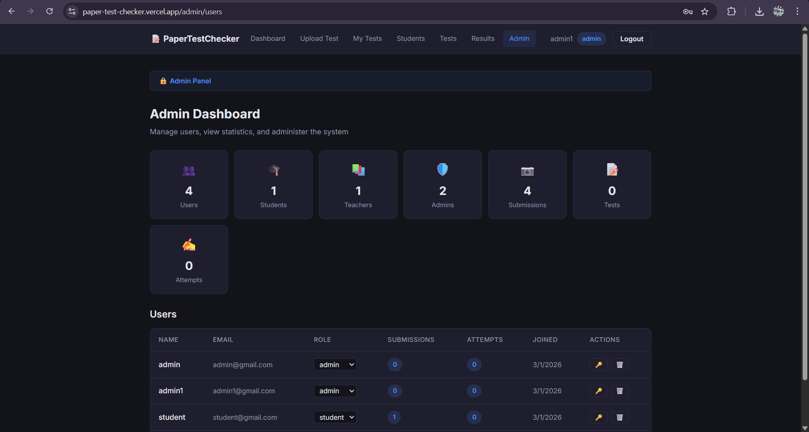
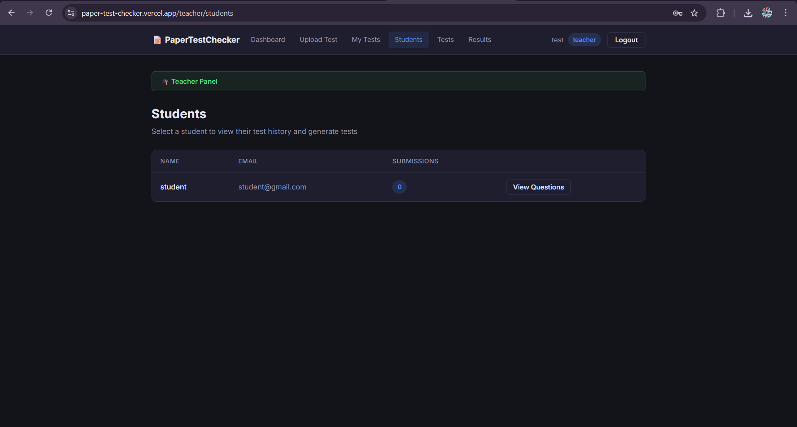
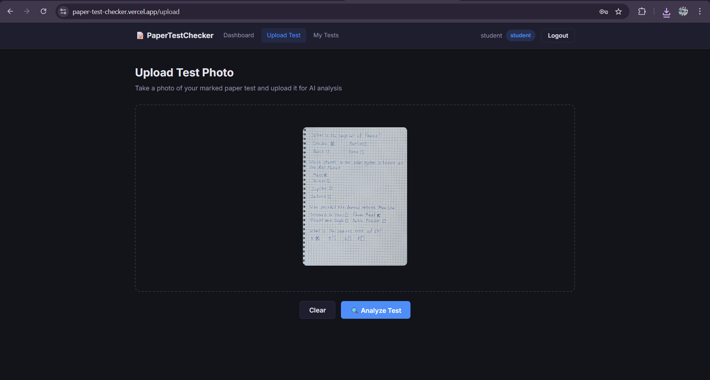
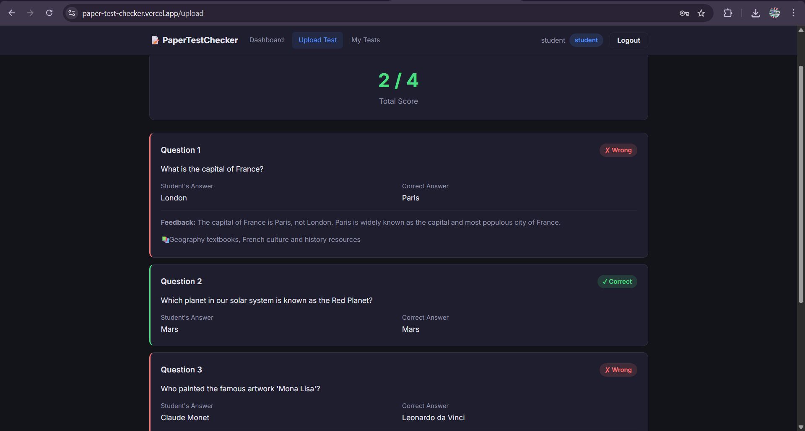
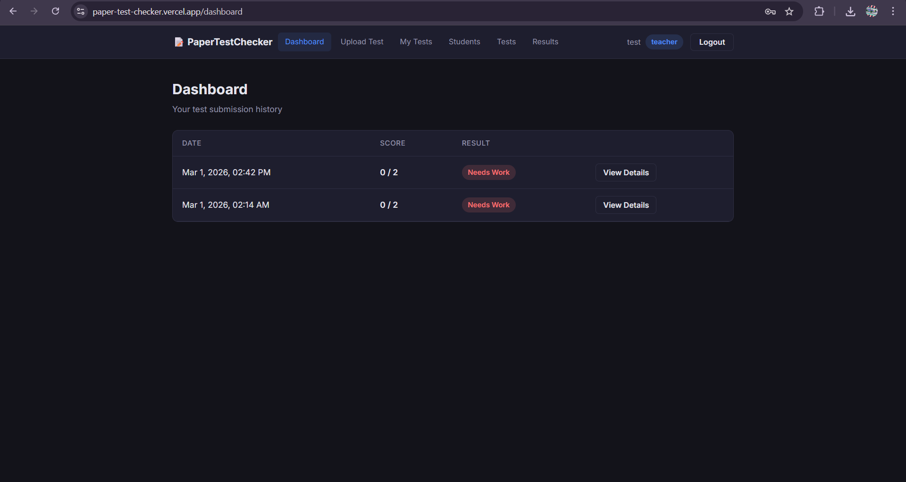

# PaperTestChecker (Test Checking Assistant)

🌍 **[Try the Live Web App Here!](https://paper-test-checker.vercel.app/login)**

## Overview
**Test Checking Assistant** is a web-based system designed to evaluate paper tests, provide detailed feedback based on student mistakes, and automatically generate a curated list of reading materials and resources for improvement. 

This project was built as a proof-of-concept for **AI-Driven Development**, with the strict goal of delivering a working application where **at least 90% of the code is generated by AI tools**. 

### Key Project Features:
- **Full-Stack Runnable Solution**: A functioning UI and API working seamlessly together.
- **Frontend (React + Vite)**: Includes multiple pages, React Router setup, and distinct layouts (e.g., Main Layout, Admin Layout, Teacher Dashboard).
- **Backend (ASP.NET Core 8)**: REST API, Entity Framework Core, JWT Authentication, and PostgreSQL integration.
- **AI Integration**: Integrates directly with LLMs (via Groq/Gemini) to process teacher uploads and evaluate student test answers.

> ⚠️ **Note:** Because this was built rapidly as an experimental AI-driven proof of concept, there are still some known bugs and UI/UX issues present in the current MVP. However, if you find this project interesting or useful, please reach out! I am highly motivated to continue developing and refining this application.

---

## 📸 App Walkthrough & Screenshots

### 1. Admin Panel
*The Admin Panel is the control center for user management. Administrators can view registered accounts, assign roles (Teacher, Student, Admin), and manage system access to ensure that only authorized personnel can grade tests or view results.*


### 2. Teacher Dashboard & Student Management
*Teachers have access to a dedicated dashboard where they can manage their classroom. This view shows the list of enrolled students, allowing the teacher to select a specific student to review their past performance or upload a new test attempt.*


### 3. Uploading a Paper Test
*The core workflow begins when a teacher uploads a photo of a physical test. The system accepts standard image formats (like the `paperTest.jpg` example).*


### 4. Auto-Grading & AI Feedback Results
*Once uploaded, the AI processes the image, extracts the student's answers, compares them to the correct answers, and generates a detailed report. This view shows the final score, specific feedback on incorrect answers, and curated reading recommendations to help the student improve.*


### 5. Main Dashboard
*A clean, overarching dashboard providing quick navigation between the different modules of the application based on the user's role.*


### 💡 Try It Yourself: Interactive Test Generation
*Note: One powerful feature not fully pictured above is the interactive test generation. If you log in as a **Teacher**, you can explore a feature that dynamically generates a new test for a student based on their previous mistakes and learning needs. I encourage you to try this out yourself!*

---

## The AI-Driven Approach (Prompt History & Workflow)

The core development methodology relied on using **multiple AI assistants in tandem**. One AI chat was used strictly for generating high-level prompts and planning, while the second AI chat (e.g., GitHub Copilot or VS Copilot) executed those prompts to generate the actual codebase. 

### Key AI Roles & Example Prompts

#### 1. The Business Analyst (Requirements & Scope)
**Goal:** Define the exact features, acceptance criteria (AC), and user stories.
> **Prompt:** *"Act as a Senior Business Analyst. I want to build a 'Test Checking Assistant' system from scratch using React and ASP.NET. The system should allow teachers to upload test results, automatically check them for mistakes using AI, and generate a list of reading materials for the student based on their specific errors. Please break this down into 5-7 core epics, and provide detailed Acceptance Criteria for the MVP features. Include different user roles like Admin, Teacher, and Student."*

#### 2. The Software Architect (Tech Stack & Patterns)
**Goal:** Establish the technical foundation, database schema, and design patterns.
> **Prompt:** *"Act as a Principal Software Architect. Based on the Business Analyst's requirements for the 'Test Checking Assistant', design the technical architecture. We will strictly use ASP.NET Core 8 for the backend and React (Vite) for the frontend. Suggest the database schema (Entities and relationships), the folder structure for the backend (e.g., Services, DTOs, Controllers), and recommend free hosting platforms for deployment (e.g., Vercel, Render, Neon.tech)."*

#### 3. The Lead Programmer (Code Generation)
**Goal:** Write the actual implementation code sequentially. 

**Workflow Rule (Context constraints):** 
Because AI models like Copilot have context limitations, prompts must be kept small and focused. The architecture was built step-by-step rather than via one massive prompt.

**Example Real-World Prompts Used:**

* **Generating Models:** 
  > *"You are a C# entity generator. Create `backend/Models/Question.cs` under namespace `PaperTestChecker.Models`. Class Question: Guid Id, Guid TestId, int QuestionIndex, string Text, string QuestionType ('mc'|'short'|'long'), string? OptionsJson (or use object Options as List<string> with `[Column(TypeName="jsonb")]`), string CorrectAnswer, string? TagsJson or Tags as List<string> stored as JSONB; navigation property Test Test. Use EF Core attributes and XML comments. Header comment. Output file only."*

* **Generating Controllers:** 
  > *"You are a C# ASP.NET Core controller generator. Create `backend/Controllers/TestsController.cs`. Requirements: Namespace `PaperTestChecker.Controllers`, `[ApiController]`, `[Route("api/[controller]")]`. Inject `AppDbContext` and `ILogger`. Add action signatures for GET /tests, GET /tests/{id}, POST /tests (Admin/Teacher), PUT, and DELETE. For request DTOs keep them as small internal records. Output only the file content."*

* **Generating DbContext & Following Pipeline:** 
  > *"You are a C# EF Core DbContext generator. Create file `backend/Models/AppDbContext.cs`. Add DbSet for Users and Tests. In OnModelCreating configure table names. What to do after generating: Commit Program.cs. Then generate basic User and Test models. Run in backend folder: dotnet restore, dotnet build, dotnet run."*

#### 4. The Runtime AI (Image Analysis & Grading)
Once the application was built, the backend needed a structured prompt to convert raw images of tests into graded, structured JSON data. This prompt is currently executed by the Groq Vision model.

**Prompt Description:**
This prompt acts as the core engine of the application's domain logic. It bypasses traditional text-only OCR by using a multimodal Vision LLM to read the physical test *and* comprehend the student's handwritten selections simultaneously. It instructs the AI to not only grade the test, but to act as a tutor by generating explanations for mistakes, suggesting topical reading materials, and reverse-engineering 3 plausible wrong answers (distractors) to build a robust data model for the frontend UI.

**The Core Grading Prompt:**
```text
You are a test-checking assistant. Analyze the uploaded photo of a paper test.

The photo shows a test paper with questions and answer options. 
The student has marked their chosen answers on the paper.

Your task:
1. Identify each question and its answer options from the photo
2. Determine which answer the student selected/marked
3. Determine the correct answer for each question
4. Grade each question (correct or incorrect)
5. Provide brief, helpful feedback for incorrect answers explaining why the correct answer is right
6. For incorrect answers, suggest 1-3 specific reading materials or topics the student should study to improve
7. For each question, generate exactly 4 answer options (including the correct answer and 3 plausible distractors)

Respond ONLY with valid JSON in exactly this format (no markdown, no code fences):
{
  "questions": [
    {
      "questionNumber": 1,
      "questionText": "The full question text",
      "studentAnswer": "What the student marked",
      "correctAnswer": "The correct answer",
      "isCorrect": true,
      "feedback": "Brief explanation (empty string if correct)",
      "recommendedReadings": ["Topic or book to study"],
      "options": ["Option A", "Option B", "Option C", "Option D"]
    }
  ],
  "totalScore": 3,
  "maxScore": 5
}

Important rules:
- If you cannot read a question or answer clearly, note it in the feedback
- recommendedReadings should be empty array [] for correct answers
- feedback should be empty string "" for correct answers
- totalScore is the count of correct answers
- maxScore is the total number of questions
- options must always contain exactly 4 items, one of which is the correctAnswer
- options distractors should be plausible but clearly wrong
```

---

## Tools, Technologies & MCPs Used

### Tech Stack
- **Frontend:** React, Vite, React Router, Tailwind CSS (or Vanilla CSS Modules).
- **Backend:** C#, ASP.NET Core 8 Web API, Entity Framework Core.
- **Database:** PostgreSQL.
- **Deployment:** Vercel (Frontend), Render (Backend API), Neon.tech (Managed serverless PostgreSQL).

### AI Tools & Models
- **Code Generation:** GitHub Copilot, Visual Studio Copilot, Google DeepMind Antigravity (Agentic Coding).
- **Recommended Free LLMs for Project Integration:** 
  - **Groq (Llama 3 / Mixtral):** Lightning-fast, free-tier API for analyzing the test text. Ideal for real-time grading and feedback generation.

---

## 🚀 How to Run Locally

### 1. Backend Configuration
You will need a running PostgreSQL database (e.g., via Docker or Neon.tech).
1. Navigate to the backend folder: `cd backend/PaperTestChecker`
2. Create or open the `appsettings.Development.json` file in that folder and add your variables like so:
   ```json
   {
     "ConnectionStrings": {
       "DefaultConnection": "Host=localhost;Port=5432;Database=paper_test;Username=postgres;Password=YOUR_DB_PASSWORD_HERE"
     },
     "Jwt": {
       "Secret": "YOUR_SUPER_SECRET_JWT_KEY_HERE_MUST_BE_LONG"
     },
     "Ai": {
       "ApiKey": "YOUR_GROQ_API_KEY_HERE"
     }
   }
   ```
3. Restore dependencies: `dotnet restore`
4. Apply Entity Framework migrations (this creates the database tables): `dotnet ef database update`
5. Run the API: `dotnet run` (by default, it will listen on `http://localhost:5000` or `http://localhost:5038`).

### 2. Frontend Configuration
1. Navigate to the frontend folder: `cd frontend`
2. Install dependencies: `npm install`
3. Create a `.env` file in the `frontend` folder and point your Vite API variable to the backend:
   ```env
   VITE_API_URL=http://localhost:5000/api
   ```
4. Start the development server: `npm run dev`

---

## 🌍 Deployment

For detailed instructions on how to set up environment variables for production and how to deploy the Backend to Render, the Frontend to Vercel, and the Database to Neon.tech, **please refer to the [`DEPLOYMENT.md`](./DEPLOYMENT.md) file.**

---

## 🤖 GitHub Copilot Instructions

This repository includes structured [GitHub Copilot customization files](https://docs.github.com/en/copilot/reference/customization-cheat-sheet) that automatically guide Copilot to generate code consistent with this project's architecture, tech stack, and conventions.

### How It Works

| File | Scope | Purpose |
|---|---|---|
| [`.github/copilot-instructions.md`](./.github/copilot-instructions.md) | Always active — every chat conversation | Project overview, full tech stack, monorepo structure, and critical cross-cutting rules |
| [`.github/instructions/backend.instructions.md`](./.github/instructions/backend.instructions.md) | Auto-applied to `backend/**/*.cs` | ASP.NET Core 8 conventions: thin controllers, service layer, DTOs, EF Core, auth & async rules |
| [`.github/instructions/frontend.instructions.md`](./.github/instructions/frontend.instructions.md) | Auto-applied to `frontend/src/**/*.{jsx,js}` | React/Vite conventions: environment variables, `src/api/` layer, Context API, CSS Modules |

### What the Instructions Enforce

**Across the whole project (`copilot-instructions.md`):**
- Never hardcode secrets — use `appsettings.Development.json` locally, env vars in production.
- Always use `async`/`await` end-to-end; no blocking `.Result` or `.Wait()` calls.
- All protected endpoints must declare `[Authorize(Roles = "...")]` explicitly.
- Follow the existing file and folder structure before creating new files.

**Backend (`backend.instructions.md`):**
- Controllers stay thin — business logic goes into `Services/`.
- DTOs are separate classes in `DTOs/` with naming convention `XxxRequestDto` / `XxxResponseDto`.
- EF Core: `Guid` PKs, snake_case table names, JSONB for list/dict columns.

**Frontend (`frontend.instructions.md`):**
- Read the API base URL from `import.meta.env.VITE_API_URL` — never hardcode `localhost`.
- All HTTP calls go through the `src/api/` wrappers — no raw `fetch()` in components.
- Auth state comes from `src/context/` — do not introduce external state libraries.
- Style with `src/index.css` utilities and CSS Modules — no inline styles.

> **Requires:** VS Code with the GitHub Copilot extension **v1.290 or later** for scoped instruction file support.

---

## Insights and Recommendations for Copilot & AI Development

If you plan to use this dual-AI (Planner + Executor) approach in the future, keep these insights in mind:

1. **Context is Everything:** Copilot works best when it has context. Open the relevant files (`DbContext`, existing `Models`, `appsettings.json`) in your editor *before* asking it to generate a new service or controller. 
2. **Iterative Generation:** Do not ask the AI to "Build the whole test checking feature." Break it down:
   - *Step 1:* Create the Models and Migrations.
   - *Step 2:* Create the DTOs and Service layer.
   - *Step 3:* Create the Controller and test it via Swagger.
   - *Step 4:* Create the React components and connect them to the API.
3. **Keep the "Planner" and "Executor" Separated:** By having one AI act strictly as the Project Manager/Architect, you prevent the coding assistant from getting lost in the weeds or hallucinating contradictory requirements. You feed the Architect's strict blueprint to the Programmer.
4. **Use Agentic Tools for Refactoring:** Tools like MCP (Model Context Protocol) or multi-file editing agents are incredibly powerful for sweeping changes (like renaming a core entity or updating CORS policies across the stack) rather than trying to manually guide Copilot line-by-line.
5. **Always Review AI Security:** AI will often hardcode secrets or use overly permissive CORS policies (e.g., `AllowAnyOrigin`) to get things working quickly. Always review configuration files manually before deploying to production.

---

## Limitations & "Bad Experiences" with AI Planning

While the AI successfully generated a skeleton for the project, the planning phase (using roles like Business Analyst and Software Architect) revealed significant limitations in how LLMs handle complex domain logic.

Based on an analysis of the generated `BA_backlog.json` and `Architecture.json`, here are the key pitfalls we encountered:

### 1. The "Happy Path" Illusion
The AI Business Analyst generated user stories (like `US-301` for uploading tests and running OCR) that sound feature-complete on paper. However, it entirely missed the edge cases required for a functional real-world system. It assumed OCR would magically return a structured `rawText` and `structuredAnswers`, completely ignoring the complex logic required to map messy, handwritten OCR fragments to specific questions securely. 

### 2. Missing Core Domain Logic
The Architecture JSON mapped out CRUD endpoints perfectly (e.g., `POST /api/tests/{id}/grade`), but it failed to articulate *how* grading actually works. 
- How does the system handle partial credit for open-ended questions? 
- How does the system map a generic vector embedding similarity score back to a human-readable grade?
The AI treated "Grading" as a simple database update rather than a complex domain service requiring detailed algorithms.

### 3. Disconnected System Thinking
The Architect AI suggested using a Python microservice with `sentence-transformers` for embeddings, alongside an ASP.NET backend and a Qdrant vector database. While technically sound, it grossly underestimated the orchestration complexity (CORS issues, network boundaries between services, port mapping in Docker) for a minimal MVP. It defaulted to "Enterprise Scale" when a monolithic approach would have been much faster to iterate on.

### 4. Blind Execution Without Context Awareness
When working in agentic or multi-file generation modes, Copilot often executes prompts literally without checking existing project state. For example, when asked to "generate `Program.cs` with login logic in the backend folder," the AI blindly created a *second* `backend/Program.cs` file, completely ignoring the fact that an application entry point already existed. The AI failed to merge the new requirements into the existing file because the prompt lacked explicit instructions to "update" rather than "create."

### Summary
**AI is an excellent typist but a poor domain expert.** The AI plans (the JSON files) serve as a great table of contents, but humans must explicitly define the complex business logic, edge cases, and algorithmic mapping that the AI glosses over. If you blindly hand an AI Architect's JSON to an AI Programmer, you will get a system that compiles but lacks the actual intelligence required to solve the business problem.

---

## Tool Comparison: Copilot vs. Antigravity

During the development of this application, different AI coding assistants were tested. A clear contrast emerged between traditional autocomplete/chat assistants and autonomous agentic coding tools like **Google DeepMind Antigravity**.

* **GitHub Copilot (using GPT-5 mini & Claude 3 Opus 4.6)**: 
  Copilot was extremely fast at generating boilerplate but suffered heavily from a lack of context awareness. As noted above, it frequently executed prompts literally—such as generating duplicate files or overwriting logic—because it functions primarily as an advanced autocomplete. It does not pause to "think" or autonomously search the workspace before streaming tokens; it relies entirely on the context the human manually curates in the editor.
  
* **Antigravity (using GPT-3.1 pro & Claude 3 Opus 4.6)**: 
  Antigravity proved significantly more effective despite using nominally "older" model backends in some configurations. The core difference is architectural: **Antigravity operates under a strict set of internal systemic instructions (an Agentic Loop).** Rather than just predicting the next word, it is instructed to:
  1. **Reason:** Analyze the goal.
  2. **Act:** Use independent tools to list directories, read files, or search for keywords to build context.
  3. **Observe:** Read the results of those tools *before* writing replacing code.
  
  Because Antigravity has these internal instructions forcing it to act as an autonomous agent, it proactively gathers context that Copilot ignores, drastically reducing regressions, duplicate files, and architectural drift.
